# 🌐 Networking & API Fundamentals

Before learning APIs, it is important to understand how the internet works.

Most beginners jump directly to APIs without understanding the technologies underneath.

A professional backend engineer understands:

```mermaid
flowchart LR
    A[User] --> B[Browser]
    B --> C[DNS Lookup]
    C --> D[IP Address]
    D --> E[TCP Connection]
    E --> F[SSL/TLS Handshake]
    F --> G[HTTPS Request]
    G --> H[Server]
    H --> I[Database]
    I --> J[Response]
    J --> K[Browser]
    K --> L[Webpage Displayed]
```

---

# 🌐 How the Internet Works

Let's take a simple example:

```text
google.com
```

When you type `google.com` into your browser and press Enter, a series of events happen in milliseconds.

---

# Step 1: Browser

## Definition

A browser is a software application used to access websites.

Examples:

* Google Chrome
* Firefox
* Safari
* Microsoft Edge

## Technical Explanation

The browser is responsible for:

1. Finding the server
2. Sending requests
3. Receiving responses
4. Displaying webpages

## Real-Life Example

Think of a browser as a personal assistant.

You say:

```text
Get me today's newspaper.
```

The assistant:

* Finds the newspaper office
* Requests the newspaper
* Brings it back to you

Similarly:

```text
Browser
 ↓
Find Website
 ↓
Request Data
 ↓
Display Webpage
```

## Why Is It Needed?

Without a browser:

* No website access
* No requests
* No webpage rendering

## Flowchart

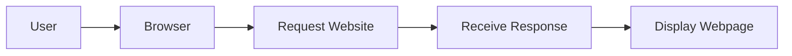

## Key Takeaway

The browser acts as the bridge between users and the internet.

---

# Step 2: DNS (Domain Name System)

## Definition

DNS converts domain names into IP addresses.

Example:

```text
google.com
     ↓
142.250.183.14
```

## Technical Explanation

Computers don't understand:

```text
google.com
```

They understand:

```text
142.250.183.14
```

DNS performs this conversion.

## Real-Life Example

Think about your phone contacts.

You save:

```text
Mom
Dad
Rahul
```

instead of:

```text
123456789
987654321
122345678
```

When you click "Mom":

```text
Mom
 ↓
Phone Number
```

DNS works the same way:

```text
google.com
 ↓
IP Address
```

## Why Is It Needed?

Without DNS:

```text
https://142.250.183.14
```

instead of:

```text
https://google.com
```

Users would need to remember IP addresses for every website.

## Flowchart

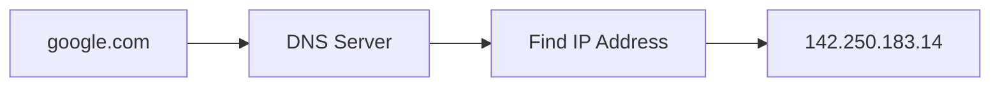

## Key Takeaway

DNS is the internet's phonebook.

---

# Step 3: IP Address

## Definition

An IP Address uniquely identifies a device on a network.

Example:

```text
142.250.183.14
```

## Real-Life Example

Sending a parcel:

```text
Parcel
 ↓
Home Address
 ↓
Delivered
```

Internet version:

```text
Request
 ↓
IP Address
 ↓
Server
```

## Why Is It Needed?

Without an IP address, the browser would not know where to send the request.

## Flowchart

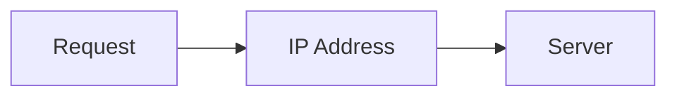

## Key Takeaway

IP addresses are the unique addresses of devices on the internet.

---

# Step 4: TCP (Transmission Control Protocol)

## Definition

TCP creates a reliable connection between client and server.

## Technical Explanation

Before data is exchanged:

```text
Client ↔ Server
```

must establish a connection.

This is called the Three-Way Handshake.

## Real-Life Example

Phone Call:

```text
You: Hello?
Server: Hello!
You: Can you hear me?
Server: Yes.
```

Connection established.

## Why Is It Needed?

Without TCP:

```text
Packet 1
Packet 3
Packet 2
Packet Lost
```

Data may arrive incorrectly.

TCP guarantees:

* Correct order
* No missing packets
* Reliable delivery

## Flowchart

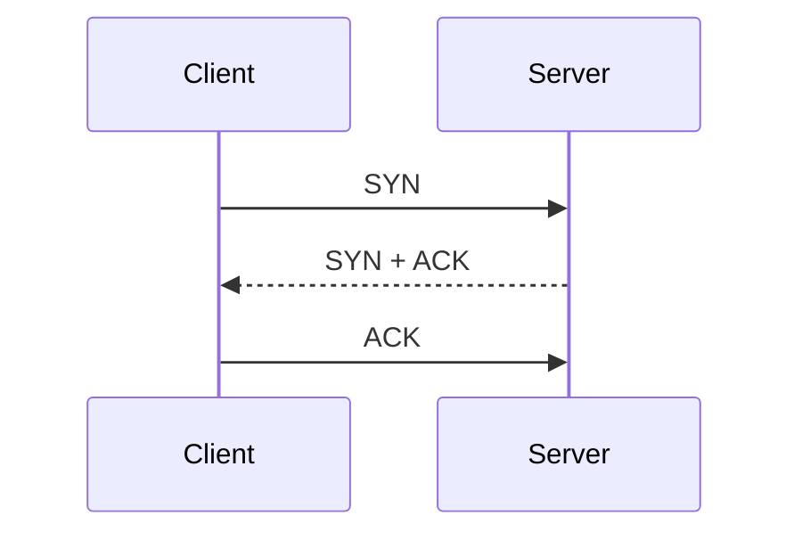

## Key Takeaway

TCP ensures reliable communication.

---

# Step 5: SSL/TLS

## Definition

SSL/TLS encrypts communication between client and server.

## Real-Life Example

Without SSL:

```text
Postcard
 ↓
Anyone Can Read
```

With SSL:

```text
Locked Envelope
 ↓
Only Receiver Can Read
```

## Why Is It Needed?

Protects:

* Passwords
* Credit Card Data
* Personal Information

## Flowchart

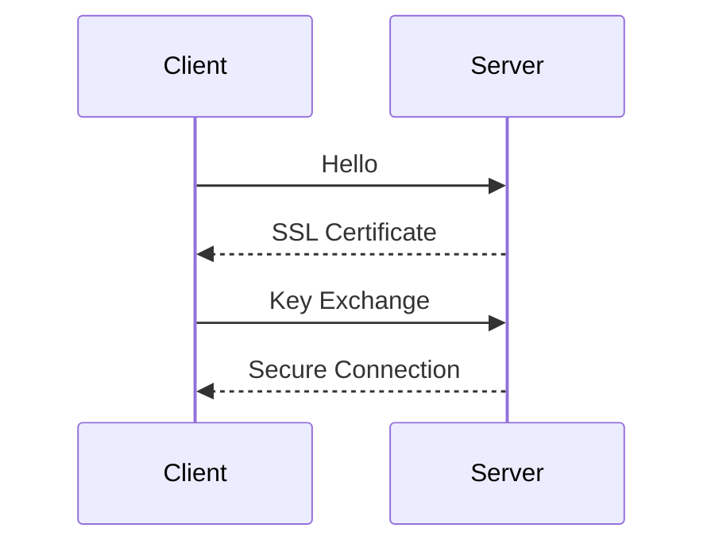

## Key Takeaway

SSL/TLS keeps internet communication secure.

---
# Step 6: HTTPS (HyperText Transfer Protocol Secure)

## Definition

HTTPS is the secure version of HTTP.

```text
HTTPS = HTTP + SSL/TLS
```

It encrypts all communication between the browser and the server.

---

## Technical Explanation

When you visit:

```text
https://google.com
```

The browser:

1. Establishes a TCP connection.
2. Performs SSL/TLS handshake.
3. Encrypts all data.
4. Sends secure requests.

---

## Real-Life Example

Imagine sending a letter.

### HTTP

```text
Letter
 ↓
Anyone Can Read
```

### HTTPS

```text
Sealed Confidential Letter
 ↓
Only Receiver Can Read
```

HTTPS is the sealed confidential letter.

---

## Why Is It Needed?

Without HTTPS:

* Passwords can be stolen
* Credit card information can be intercepted
* Personal information can leak

---

## Flowchart

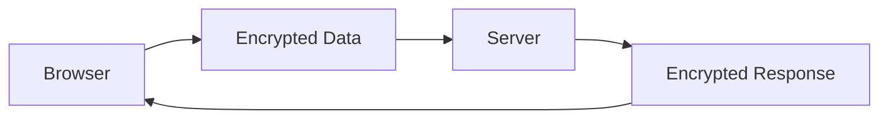

---

## Interview Question

**Q:** What is the difference between HTTP and HTTPS?

**A:** HTTPS uses SSL/TLS encryption while HTTP sends data in plain text.

---

## Key Takeaway

HTTPS protects data while it travels across the internet.

---

# Step 7: HTTP Request

## Definition

An HTTP Request is sent from the client to the server asking for information or requesting an action.

---

## Technical Example

```http
GET /users
Host: api.example.com
```

Meaning:

```text
Give me all users.
```

---

## Real-Life Example

Restaurant Example:

```text
Customer
 ↓
Order Food
 ↓
Kitchen
```

The order is the request.

Similarly:

```text
Browser
 ↓
HTTP Request
 ↓
Server
```

---

## Why Is It Needed?

Without requests:

```text
No communication
No data retrieval
```

---

## Flowchart

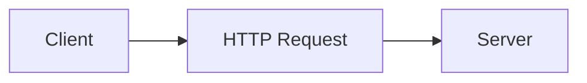

---

## Key Takeaway

Requests ask servers to perform actions or return data.

---

# Step 8: Server

## Definition

A server is a computer that receives requests and sends responses.

---

## Technical Explanation

The server:

1. Receives requests.
2. Processes business logic.
3. Queries databases.
4. Generates responses.

---

## Real-Life Example

Restaurant Kitchen

```text
Customer
 ↓
Waiter
 ↓
Kitchen
 ↓
Food Prepared
```

The kitchen acts like a server.

---

## Why Is It Needed?

Without servers:

```text
No websites
No applications
No APIs
```

---

## Flowchart

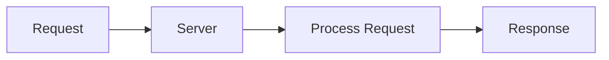

---

## Key Takeaway

Servers are responsible for processing requests and generating responses.

---

# Step 9: Database

## Definition

A database stores application data.

Examples:

* Users
* Orders
* Products
* Posts
* Comments

---

## Technical Explanation

The server stores and retrieves information from databases.

Example:

```sql
SELECT * FROM users;
```

---

## Real-Life Example

Library

```text
Library
 ↓
Books Stored
 ↓
Find Book
 ↓
Return Book
```

Database:

```text
Database
 ↓
Store Data
 ↓
Find Data
 ↓
Return Data
```

---

## Why Is It Needed?

Without databases:

```text
No stored users
No saved posts
No history
```

Everything would be forgotten after restart.

---

## Flowchart

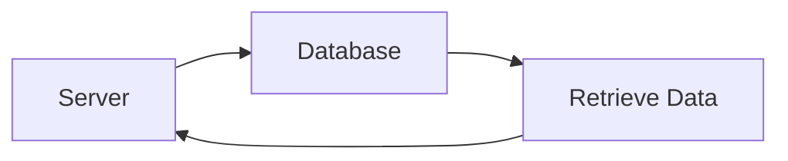

---

## Key Takeaway

Databases provide permanent storage for applications.

---

# Step 10: HTTP Response

## Definition

An HTTP Response is the data returned by the server.

---

## Technical Example

```http
HTTP/1.1 200 OK
Content-Type: application/json
```

```json
{
  "name": "Karina"
}
```

---

## Real-Life Example

Restaurant

```text
Customer Orders Food
 ↓
Kitchen Prepares Food
 ↓
Food Served
```

Food served = Response

Internet version:

```text
Request
 ↓
Server
 ↓
Response
```

---

## Why Is It Needed?

Without responses:

```text
Client never receives data.
```

---

## Flowchart

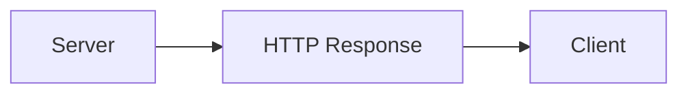

---

## Key Takeaway

Responses contain the data requested by clients.

---

# Step 11: API (Application Programming Interface)

## Definition

An API allows two applications to communicate with each other.

---

## Technical Example

Instagram App:

```text
Instagram App
 ↓
API Request
 ↓
Instagram Server
 ↓
Database
 ↓
API Response
 ↓
Instagram App
```

---

## Real-Life Example

Restaurant Waiter

```text
Customer
 ↓
Waiter
 ↓
Kitchen
 ↓
Waiter
 ↓
Customer
```

The waiter is the API.

The customer never enters the kitchen.

Similarly:

```text
Frontend
 ↓
API
 ↓
Backend
```

The frontend never directly accesses the database.

---

## Why Is It Needed?

APIs:

* Connect applications
* Share data
* Hide internal complexity
* Improve security

---

## Flowchart

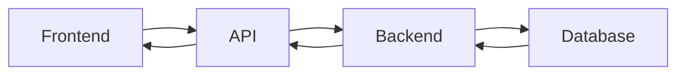

---

## Key Takeaway

APIs act as messengers between applications.

---

# 🚀 Complete Request Lifecycle

## What Happens When You Open Google?

```mermaid
flowchart LR
    A[User Types google.com]
    --> B[Browser]

    B --> C[DNS Lookup]
    C --> D[IP Address]

    D --> E[TCP Connection]
    E --> F[SSL/TLS Handshake]

    F --> G[HTTPS Request]
    G --> H[Google Server]

    H --> I[Database / Services]

    I --> J[HTTP Response]

    J --> K[Browser]

    K --> L[Render HTML CSS JS]

    L --> M[Google Webpage Displayed]
```

---

# Final Summary

When you type:

```text
google.com
```

the following happens:

1. Browser starts the request.
2. DNS finds the IP address.
3. TCP establishes a connection.
4. SSL/TLS secures the connection.
5. HTTPS sends the request.
6. Server processes the request.
7. Database retrieves data.
8. Server sends response.
9. Browser renders webpage.

All of this happens within milliseconds.

# Additional Networking Concepts

These concepts are frequently asked in interviews and are essential for understanding APIs, backend development, and system design.

---

# What is a Protocol?

## Definition

A protocol is a set of rules that devices follow to communicate with each other.

Examples:

* HTTP
* HTTPS
* TCP
* UDP
* FTP
* SSH

---

## Real-Life Example

Imagine two people speaking.

For communication to happen:

```text
Person A → English
Person B → English
```

Both follow the same language.

Similarly:

```text
Client → HTTP
Server → HTTP
```

Both follow the same protocol.

---

## Why Is It Needed?

Without protocols:

```text
Client: Sends Data
Server: Doesn't Understand
```

Communication would fail.

---

## Flowchart

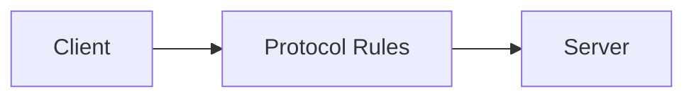

---

## Key Takeaway

Protocols define how communication happens between systems.

---

# HTTP vs HTTPS

## Definition

HTTP and HTTPS are protocols used for communication between clients and servers.

---

## Comparison

| Feature    | HTTP                        | HTTPS                              |
| ---------- | --------------------------- | ---------------------------------- |
| Full Form  | HyperText Transfer Protocol | HyperText Transfer Protocol Secure |
| Encryption | ❌ No                        | ✅ Yes                              |
| Security   | Low                         | High                               |
| Port       | 80                          | 443                                |
| SSL/TLS    | ❌                           | ✅                                  |

---

## Real-Life Example

### HTTP

```text
Postcard
```

Anyone handling the postcard can read it.

---

### HTTPS

```text
Sealed Envelope
```

Only the intended receiver can read it.

---

## Why HTTPS Is Needed?

Without HTTPS:

* Passwords can be stolen
* Banking details can be intercepted
* Sensitive information can leak

---

## Flowchart

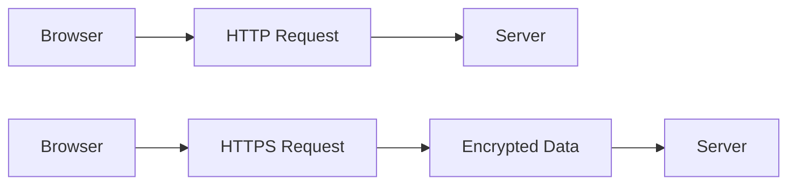

---

## Key Takeaway

Always use HTTPS in production applications.

---

# Client vs Server

## Client

A client requests data.

Examples:

* Browser
* Mobile App
* Postman
* Python Script

---

## Server

A server provides data.

Examples:

* Google Server
* Instagram Backend
* FastAPI Application

---

## Real-Life Example

Restaurant Example:

```text
Customer
    ↓
Places Order
```

Customer = Client

---

```text
Kitchen
    ↓
Prepares Food
```

Kitchen = Server

---

## Flowchart

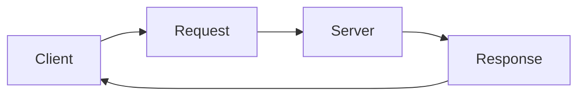

---

## Key Takeaway

Client asks.
Server answers.

---

# Ports

## Definition

A port identifies a specific service running on a machine.

---

## Common Ports

| Service    | Port  |
| ---------- | ----- |
| HTTP       | 80    |
| HTTPS      | 443   |
| SSH        | 22    |
| FTP        | 21    |
| MySQL      | 3306  |
| PostgreSQL | 5432  |
| MongoDB    | 27017 |

---

## Real-Life Example

Apartment Building:

```text
Building Address
```

represents:

```text
IP Address
```

---

```text
Flat Number
```

represents:

```text
Port
```

Example:

```text
192.168.1.10:443
```

Meaning:

```text
Building = 192.168.1.10
Flat = 443
```

---

## Why Ports Are Needed?

A server can run multiple services.

Example:

```text
Port 22 → SSH

Port 80 → HTTP

Port 443 → HTTPS
```

The operating system needs to know which application should receive the request.

---

## Flowchart

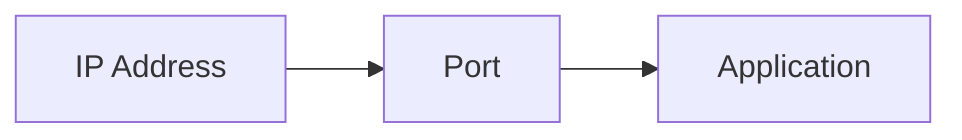

---

## Key Takeaway

IP identifies the machine.
Port identifies the service.

---

# Stateless Nature of HTTP

## Definition

HTTP is stateless.

This means:

```text
Every request is independent.
```

The server does not automatically remember previous requests.

---

## Real-Life Example

Imagine talking to a receptionist who forgets you after every question.

```text
Question 1
↓
Answered

Question 2
↓
Who are you?
```

The receptionist remembers nothing.

---

## Technical Example

Request 1:

```http
GET /profile
```

Request 2:

```http
GET /orders
```

The server treats both requests independently.

---

## Flowchart

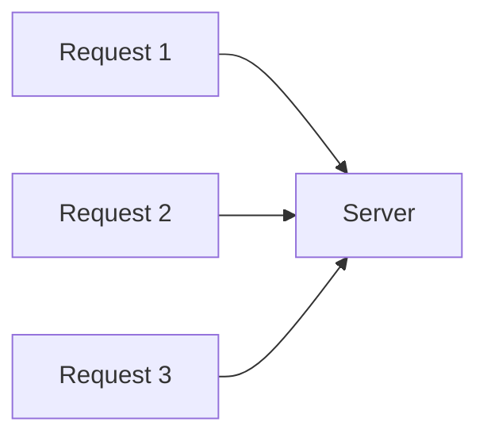

---

## Key Takeaway

HTTP does not remember previous requests.

---

# Cookies

## Definition

Cookies are small pieces of data stored by the browser.

---

## Real-Life Example

Movie Theatre Stamp:

```text
Ticket Checked
↓
Hand Stamp
```

You can re-enter without buying another ticket.

The stamp acts like a cookie.

---

## Technical Example

After login:

```text
Browser
↓
Stores Cookie
↓
Sends Cookie With Future Requests
```

---

## Flowchart

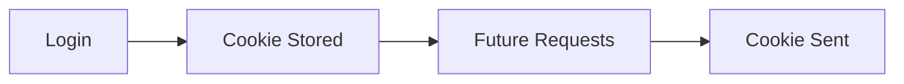

---

## Key Takeaway

Cookies help identify users across requests.

---

# Sessions

## Definition

A session stores user information on the server.

---

## Real-Life Example

Hotel Reception:

```text
Room Number
↓
Reception Database
```

Reception remembers who you are.

---

## Technical Example

```text
Browser
↓
Session ID
↓
Server
↓
Session Data
```

---

## Flowchart

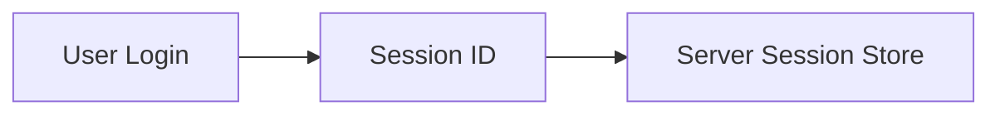

---

## Key Takeaway

Sessions help servers remember users.

---

# Caching

## Definition

Caching stores frequently used data for faster access.

---

## Real-Life Example

You keep your daily office key in your pocket.

You don't search the entire house every morning.

---

## Technical Example

Without Cache:

```text
Request
↓
Database
↓
Response
```

With Cache:

```text
Request
↓
Cache
↓
Response
```

---

## Flowchart

```mermaid
flowchart LR
    A[Request]
    --> B[Cache]

    B --> C[Response]

    B --> D[Database]
```

---

## Key Takeaway

Caching improves performance.

---

# CDN (Content Delivery Network)

## Definition

A CDN stores copies of content in multiple geographic locations.

---

## Real-Life Example

Amazon Warehouses.

Instead of shipping from one city:

```text
Customer
↓
Nearest Warehouse
↓
Delivery
```

---

## Technical Example

Instead of loading images from one server:

```text
User
↓
Nearest CDN Server
↓
Image Delivered
```

---

## Flowchart

```mermaid
flowchart LR
    A[User]
    --> B[Nearest CDN]
    --> C[Image]
```

---

## Key Takeaway

CDNs reduce latency and improve speed.

---

# Browser Developer Tools

## Definition

Developer Tools allow developers to inspect websites and APIs.

---

## How To Open

```text
Chrome
↓
F12
↓
Network Tab
```

---

## What You Can See

* URL
* Headers
* Payload
* Status Codes
* Response Body
* Request Time

---

## Real-Life Example

Mechanic opening a car engine.

Developer Tools help inspect what's happening inside a website.

---

## Flowchart

```mermaid
flowchart LR
    A[Browser]
    --> B[F12]
    --> C[Network Tab]
    --> D[API Requests]
```

---

## Key Takeaway

Network Tab is one of the most important tools for API debugging.

---

# Quick Interview Questions

1. What happens when you type google.com in a browser?
2. What is DNS?
3. What is TCP?
4. What is SSL/TLS?
5. Difference between HTTP and HTTPS?
6. What is an IP Address?
7. What is a Port?
8. What is a Cookie?
9. What is a Session?
10. What is Caching?
11. What is a CDN?
12. What is a Client?
13. What is a Server?
14. What is an API?

---

# Final Key Takeaway

To become strong in APIs and backend development, you must understand:

```text
Browser
↓
DNS
↓
IP Address
↓
TCP
↓
SSL/TLS
↓
HTTPS
↓
Client
↓
Server
↓
Database
↓
Cookies
↓
Sessions
↓
Caching
↓
CDN
↓
API
```

These concepts form the foundation of modern web applications.
