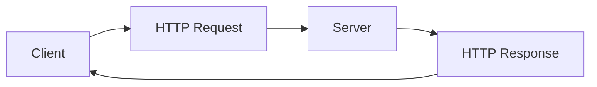
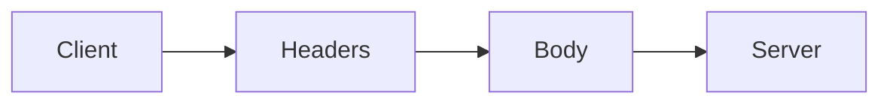
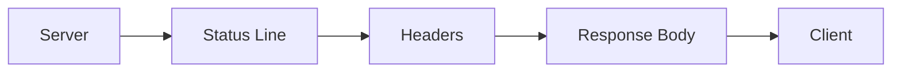

# 🚀 LEVEL 1: HTTP Mastery

Before learning APIs, you must master HTTP.

Most beginners know:

```text
GET = Fetch Data
POST = Create Data
PUT = Update Data
DELETE = Delete Data
```

This is not enough.

A backend engineer understands:

* How HTTP requests are structured
* How HTTP responses are structured
* Headers
* Payloads
* Cookies
* Authentication
* Status Codes
* Network Debugging
* Browser Developer Tools

---

# What is HTTP?

HTTP stands for:

```text
HyperText Transfer Protocol
```

It is the communication protocol used between clients and servers.

Example:

```text
Browser
   ↓
HTTP Request
   ↓
Server
   ↓
HTTP Response
   ↓
Browser
```

---

## Real-Life Example

Imagine ordering food.

```text
You
 ↓
Place Order
 ↓
Restaurant
 ↓
Food Delivered
```

Internet version:

```text
Browser
 ↓
HTTP Request
 ↓
Server
 ↓
HTTP Response
```

---

## Flowchart



---

# Anatomy of an HTTP Request

Every HTTP Request contains:

```text
Request Line
Headers
Body
Cookies
Authorization
```

---

## Complete Example

```http
POST /users HTTP/1.1
Host: api.example.com
Content-Type: application/json
Authorization: Bearer abc123

{
    "name": "Karina",
    "city": "Bangalore"
}
```

Let's understand every line.

---

# Request Line

```http
POST /users HTTP/1.1
```

Contains:

```text
Method
Path
HTTP Version
```

Breakdown:

```text
POST
```

Action to perform.

```text
/users
```

Resource.

```text
HTTP/1.1
```

Protocol version.

---

## Real-Life Example

```text
Send Parcel
To:
Flat 302
Using:
BlueDart
```

Similarly:

```text
POST
/users
HTTP/1.1
```

---

# Host Header

```http
Host: api.example.com
```

Tells the request destination.

Without Host:

```text
Server doesn't know which website is being requested.
```

---

## Real-Life Example

Like writing:

```text
To:
Karina Gupta
Bangalore
```

on an envelope.

---

# Content-Type Header

```http
Content-Type: application/json
```

Tells the server:

```text
What kind of data am I sending?
```

Examples:

```http
Content-Type: application/json
```

```http
Content-Type: text/plain
```

```http
Content-Type: multipart/form-data
```

---

## Real-Life Example

Food Delivery Package:

```text
Veg
Non-Veg
Fragile
```

Labels help identify contents.

---

# Authorization Header

```http
Authorization: Bearer abc123
```

Used to prove identity.

---

## Real-Life Example

Security Guard:

```text
Show ID Card
```

No ID:

```text
Access Denied
```

Token acts as the ID card.

---

# Request Body (Payload)

The body contains actual data.

Example:

```json
{
    "name": "Karina",
    "city": "Bangalore"
}
```

---

## Real-Life Example

Application Form

```text
Name
Address
Phone Number
```

The form contents are the payload.

---

## Flowchart



---

# Anatomy of an HTTP Response

Example:

```http
HTTP/1.1 200 OK
Content-Type: application/json

{
    "id": 1,
    "name": "Karina"
}
```

Contains:

```text
Status Line
Headers
Body
```

---

# Status Line

```http
HTTP/1.1 200 OK
```

Breakdown:

```text
HTTP Version
Status Code
Status Message
```

---

# Response Headers

Example:

```http
Content-Type: application/json
```

```http
Cache-Control: max-age=3600
```

```http
Set-Cookie: session_id=123
```

Provides metadata about the response.

---

# Response Body

Actual data returned.

Example:

```json
{
    "id": 1,
    "name": "Karina"
}
```

---

## Flowchart



---

# First Python HTTP Request

Install:

```bash
pip install requests
```

---

## GET Request

```python
import requests

response = requests.get(
    "https://jsonplaceholder.typicode.com/users"
)

print(response.status_code)
print(response.json())
```

---

## What's Happening?

```text
Python Script
 ↓
GET Request
 ↓
Server
 ↓
JSON Response
```

---

# Lab 1: Inspect Google

Open:

```text
Chrome
 ↓
F12
 ↓
Network Tab
```

Visit:

```text
https://google.com
```

Answer:

1. How many requests were made?
2. Which request loaded first?
3. What status codes do you see?
4. What request headers are present?
5. What response headers are present?

---

# Lab 2: Inspect GitHub

Open:

```text
https://github.com
```

Inspect:

* Request URL
* Request Method
* Status Code
* Content-Type
* Cookies

Write observations in a notebook.

---

# Interview Questions

1. What is HTTP?
2. What are the components of an HTTP request?
3. What are the components of an HTTP response?
4. What is a header?
5. What is a payload?
6. What is the purpose of Content-Type?
7. What is the purpose of Authorization?
8. Difference between request body and request headers?
9. What is the Host header?
10. What is HTTP/1.1?
